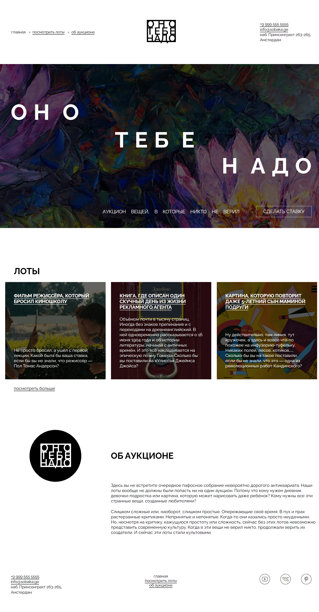

https://github.com/Hamsike/ono-tebe-nado
# Проект "Оно тебе надо"
## Оглавление
- [Скриншот](#скриншот)
- [Макет](#макет)
- [Ссылки](#ссылки)
- [Автор](#автор)
### Скриншот

### Макет
Макет задания: [Figma](https://www.figma.com/design/8KwhMpv8qnDocX4NVFQBpn/%D0%9E%D0%BD%D0%BE-%D1%82%D0%B5%D0%B1%D0%B5-%D0%BD%D0%B0%D0%B4%D0%BE?node-id=0-1&p=f&t=mUJcDqnjft9QKzR2-0)
### Ссылки
URL решения: [Github](https://github.com/Hamsike/ono-tebe-nado)
### Автор
Github - [Hamsike](https://github.com/Hamsike)